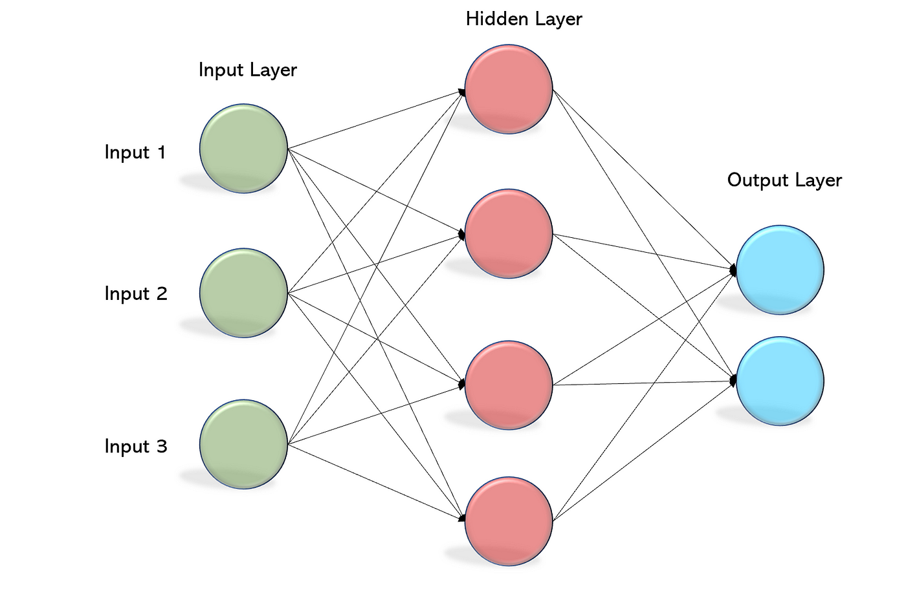

이 페이지는 A method for registration of 3D Shape 논문 리뷰를 위해 작성했습니다. 
{:.notice}

2007년즈음으로 기억한다. 선배가 Stereo Vision을 이용해서 이동속도와 회전속도를 판단하는 알고리즘을 내게 보여준 적이 있었다. 그때 제일 먼저 궁금했던건, 좀전의 이미지에서 보이는 특징점이 그 다음 이미지의 특징점과 어떻게 매칭이 되는지였다. 그때도 아마 ICP라는 용어를 그 선배가 내게 설명했을법 한데, 알고리즘의 큰 의미는 이해했지만, 그것이 어떻게 세부적으로 돌아가는지에 대해서 당시에는 내가 이해할 능력이 못되었나보다. 

SLAM, 즉 로봇이 자신의 센서정보를 바탕으로 하여 현 시점의 환경정보와 Map을 생성했을때, 이를 가지고 있는 지도데이터와 비교하는 과정에서 ICP는 매우 핵심적인 역할을 한다. 

이제 처음 SLAM관련 기본 논문을 읽어보는 입장에서, 이 이후에 얼마나 많은 발전이 있었을지 가늠할 수 없지만, 적어도 이 논문이 작성된 1998년도부터, 2000년대 초반까지는 매우 중요한 이정표같은 것이리라 생각이 든다. 

[이미지 Registration(정합)](https://kr.mathworks.com/discovery/image-registration.html)
