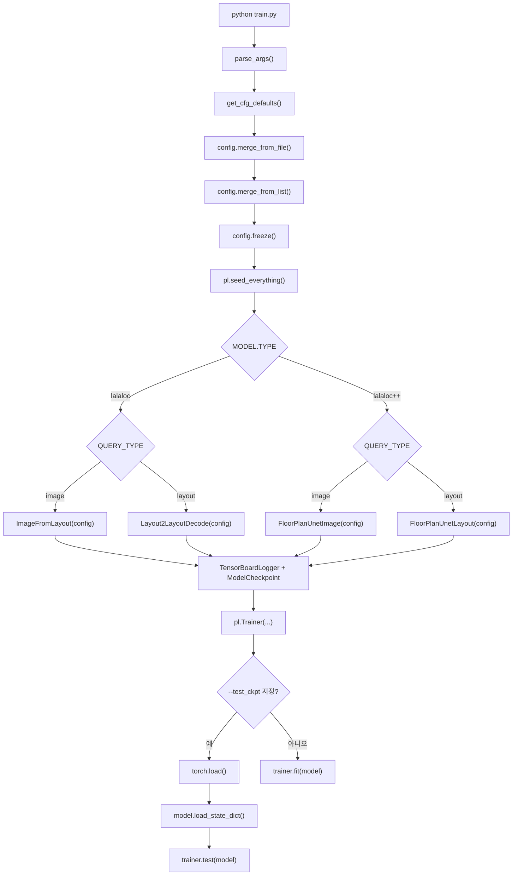
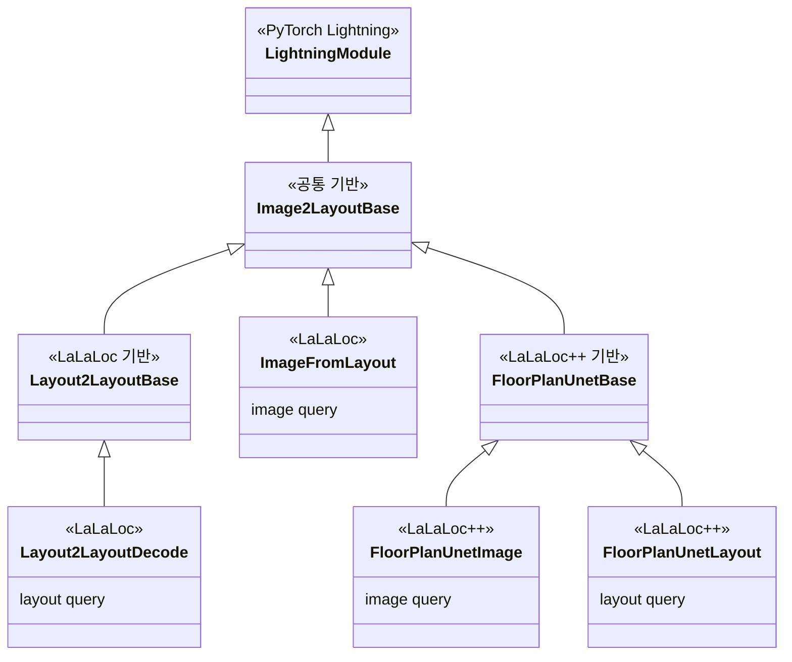
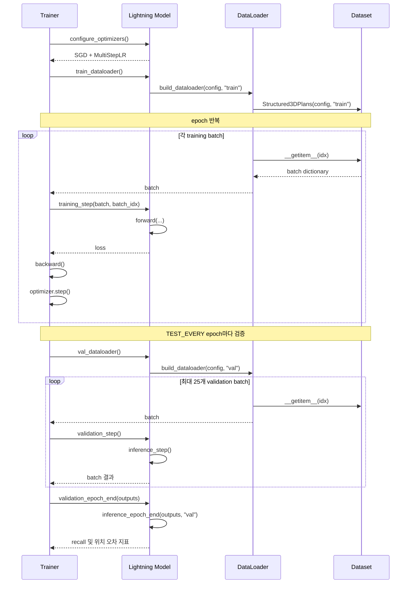

# 이어가면서. 

이런 코드리뷰하면서, 학습의 목적이라면 AI를 최대한 배제해야 하나.. 아니면 적극 활용해야 하는 고민이 든다.   
시간과 집중력의 싸움인가, 아니면 학습후 남는게 있는가의 싸움인가.... 

시작이 늦은 만큼 양을 늘려서 많이 해보는걸 목적으로 해야 하나 하는 고민이 든다.   
이 이야기를 하는 이유는, 이 다음 나오는 내용이 Codex 를 사용해서 소스코드를 분석한 내용이 들어가서이다. 

# Flowchart 

Codex를 통해 전체 Flow work 를 정리해봤다. 

지난번까지 다루었던 내용들을 토대로 주욱 훑어보면, 모델 타입에 따른 분기점 전까지 config 관련 설정 내용들이 이어진 것이고, 실행모델이 결정되면 이미지와 floorplan을 입력하여 `pl.train()`으로 전달되는것을 확인할 수 있다. 

| `MODEL.TYPE` | `QUERY_TYPE` | 생성되는 모델 | 주요 입력 |
|---|---|---|---|
| `lalaloc` | `image` | `ImageFromLayout` | 파노라마 이미지 |
| `lalaloc` | `layout` | `Layout2LayoutDecode` | 파노라마 레이아웃 |
| `lalaloc++` | `image` | `FloorPlanUnetImage` | 이미지 + floor plan |
| `lalaloc++` | `layout` | `FloorPlanUnetLayout` | 레이아웃 + floor plan |

Codex가 너무 잘 정리해주니 할 말이 없어진다. 

모델 Class의 상속관계는 다음과 같이 표현해볼 수 있다.   

- 공통 부분 
  - LightningModule 
  - Image2LayoutBase (lalaloc_base.py, line 40)

- LaLaLoc 
  - ImageFromLayout: 파노라마 이미지로 질의 (lalaloc.py, line113)
  - Layout2LayoutBase: layout-query 모델의 기반 (lalaloc_base.py, line 372)
  - Layout2LayoutDecode: 파노라마 layout으로 질의 (lalaloc.py, line 59)

- LaLaLoc++
  - FloorPlanUnetBase: floor-plan UNet 기능을 추가한 기반 (lalaloc_pp_base.py, line20)
  - FloorPlanUnetImage: 파노라마 이미지로 질의 (lalaloc_pp.py, line 188)
  - FloorPlanUnetLayout: 파노라마 layout으로 질의 (lalaloc_pp.py, line 59)

 
 
 

train을 시작하기 위해 trainer.fit(model)을 실행하면 다음 흐름으로 실행된다. 

구현 관련된 파일들은 다음과 같다. 
- Optimizer: lalaloc_base.py (line 170)  
- DataLoader: lalaloc_base.py (line 25)
- 학습/검증 훅: lalaloc_base.py (line 347)

참고로 backward()와 optimizer.step()은 코드에 직접 적혀 있지 않고 Lightning이 training_step()이 반환한 loss를 이용해 수행한다.
